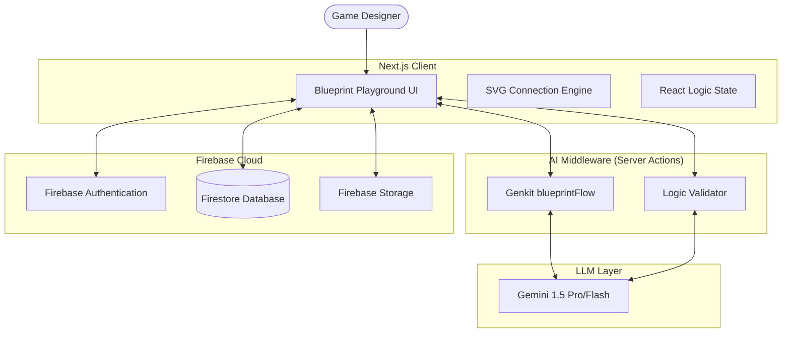

# GameSmith: The AI-Driven Blueprint Forge


GameSmith is a cutting-edge, AI-powered platform designed to revolutionize game mechanics design. It bridges the gap between natural language ideas and functional game logic by generating Unreal Engine-inspired visual node graphs (Blueprints).

## 🚀 Key Features

- **AI Blueprint Synthesis**: Generate complex game logic from simple text prompts using Gemini 1.5 and Genkit.
- **Visual Node Editor**: A custom-built, interactive canvas for managing nodes, connections, and execution flow.
- **Logic Validation**: An "Expert AI" layer that reviews generated blueprints for technical integrity and Unreal Engine best practices.
- **Real-time Simulation**: Pulse-based execution visualization to verify logic flow before implementation.
- **Enterprise Dashboard**: Comprehensive management for assets, blueprints, and user moderation (Overwatch Console).
- **Firebase Integration**: Secure cloud storage for all user-generated content and platform assets.

---

## 🏗️ Technical Architecture

GameSmith is built on a modern full-stack architecture prioritizing performance, scalability, and AI integration.

### High-Level System Design



---

## 🔄 Data Flow

1.  **Prompt Entry**: The user describes a game mechanic (e.g., *"A boss that teleports when health is below 20%"*).
2.  **Synthesis**: The description is sent to the `blueprintFlow` Genkit workflow.
3.  **AI Reasoning**: The LLM processes the prompt against a strict **Knowledge Base Catalog** of allowed node types (Events, Flow Control, Math, Actions).
4.  **JSON Mapping**: The AI returns a structured JSON object containing node positions, types, and connections.
5.  **Rendering**: The `BlueprintPlayground` component parses the JSON and renders it onto the interactive SVG canvas.
6.  **Validation/Simulation**: The user can run a "Simulation" to see the execution pulse through the nodes or invoke the "Validator" for an AI audit.
7.  **Persistence**: The final blueprint is saved to Firestore under the user's profile.

---

## 🛠️ Technology Stack

| Layer | Technology |
| :--- | :--- |
| **Framework** | [Next.js 15 (App Router)](https://nextjs.org/) |
| **Language** | [TypeScript](https://www.typescriptlang.org/) |
| **AI Framework** | [Google Genkit](https://firebase.google.com/docs/genkit) |
| **LLM** | [Gemini 1.5](https://deepmind.google/technologies/gemini/) |
| **Database/Auth** | [Firebase](https://firebase.google.com/) |
| **UI Components** | [Radix UI](https://www.radix-ui.com/) + [Shadcn/UI](https://ui.shadcn.com/) |
| **Styling** | [Tailwind CSS](https://tailwindcss.com/) |
| **Icons** | [Lucide React](https://lucide.dev/) |

---

## 📁 Project Structure

```text
src/
├── ai/                # Genkit flows and AI logic
│   ├── blueprint-flow.ts   # Core synthesis logic
│   └── validate-flow.ts    # Logic verification system
├── app/               # Next.js pages and layouts
│   ├── playground/    # The main Blueprint Forge interface
│   ├── admin/         # Overwatch Console (Moderation)
│   └── library/       # Community blueprint repository
├── components/        # Reusable React components
│   ├── ui/            # Atomic Radix components
│   └── BlueprintPlayground.tsx # Large-scale canvas component
├── firebase/          # Configuration and hook wrappers
├── hooks/             # Custom React hooks (auth, firestore)
└── lib/               # Utility functions and services
```

---

## 🚦 Getting Started

### Prerequisites

- Node.js 18+ 
- Firebase Account (Firestore & Auth enabled)
- Google Cloud Project (for Genkit/Gemini)

### Installation

1. Clone the repository:
   ```bash
   git clone https://github.com/krishnaprasanth7102/forgotten.git
   cd forgotten
   ```

2. Install dependencies:
   ```bash
   npm install
   ```

3. Configure Environment Variables (`.env.local`):
   ```env
   NEXT_PUBLIC_FIREBASE_API_KEY=your_key
   NEXT_PUBLIC_FIREBASE_AUTH_DOMAIN=your_domain
   NEXT_PUBLIC_FIREBASE_PROJECT_ID=your_id
   GOOGLE_GENAI_API_KEY=your_gemini_key
   ```

4. Run the development server:
   ```bash
   npm run dev
   ```
   Access the forge at `http://localhost:9002`.

---

## 🛡️ Security & Permissions

GameSmith implements a robust Role-Based Access Control (RBAC) system:
- **Users**: Create, save, and share blueprints.
- **Admins**: Access the Overwatch Console to moderate content, delete assets, and manage platform stability.
- **Firestore Rules**: Strict security rules ensure users can only modify their own data.

---

## 📜 Documentation & Knowledge Base

For detailed information on the AI's node catalog and prompting strategies, refer to:
- [BLUEPRINT_KNOWLEDGE_BASE.md](./BLUEPRINT_KNOWLEDGE_BASE.md)

---

*Built with ❤️ by the GameSmith Team.*
